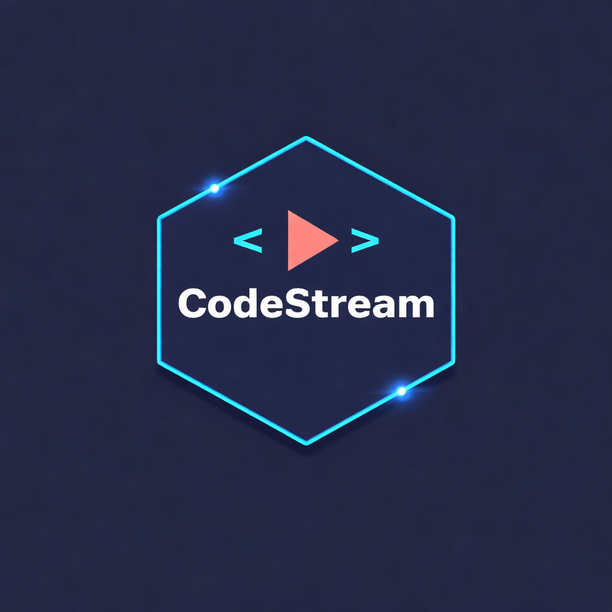

# 📚 Code Stream

Code Stream is a modern e-learning web platform built with Django that allows users to learn through video-based courses, interactive content, and structured learning paths.

It is designed to provide a smooth learning experience with user authentication, course management, video streaming, and engagement features such as likes, comments, and progress tracking.

---

## 🚀 Features

- 🔐 User Authentication (Login & Register)
- 🎥 Video-based Learning System
- 📂 Course Management
- 📱 Mobile-Friendly Responsive Design
- 🔍 Clean UI & UX
- ⚡ Fast Performance

---

## 🛠️ Tech Stack

- **Backend:** Django (Python)
- **Frontend:** HTML, Tailwind CSS, JavaScript, HTMX
- **Database:** PostgreSQL
- **Media Storage:** Cloudinary
- **Authentication:** Django Auth System & Allauth System
- **Payment Type:** Stripe
- **Scaling:** Celery

---

## 📁 Project Image
